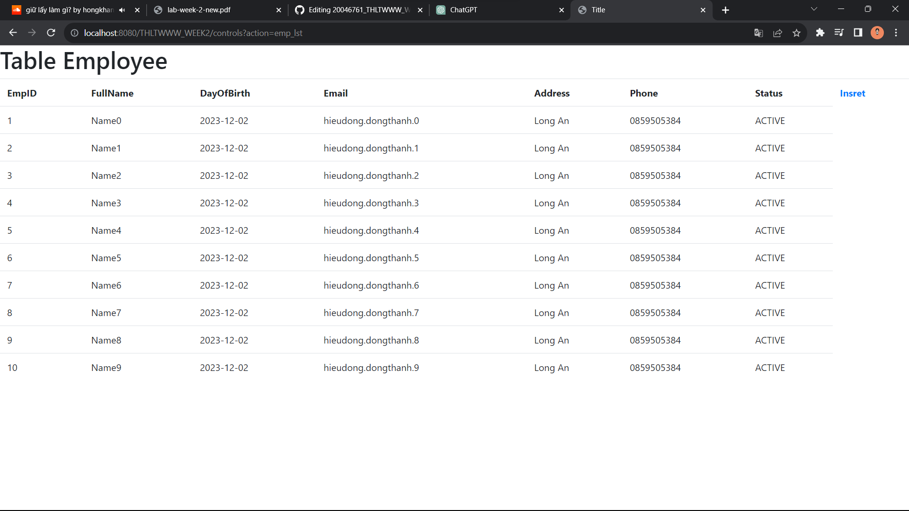

# 20046761_THLTWWW_WEEK 2 + 3
Bài lập tuần 2 + 3

Yêu cầu:
- Các thao tác CRUD cho các đối tượng, lập order. (dùng JPA).
- Thống kê order theo ngày, theo khoảng thời gian.
- Thống kê order theo nhân viên bán hàng trong 1 khoảng thời gian
- Tạo các trang web cho việc hiển thị sản phẩm, chọn vào giỏ hàng và thanh toán (giả lập
việc thanh toán qua thẻ nếu có thể)

# Demo mua sản phẩm
https://github.com/ToHieuDong/20046761_THLTWWW_WEEK2/assets/144570416/8359643a-6783-4234-9c79-68a4fc051426

# CURD Employee

